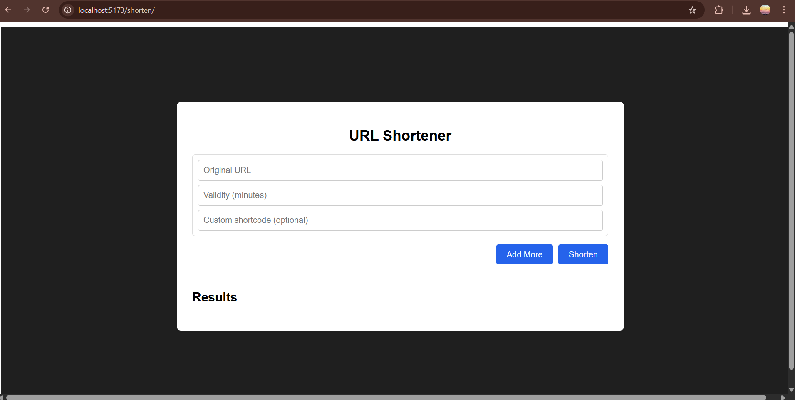
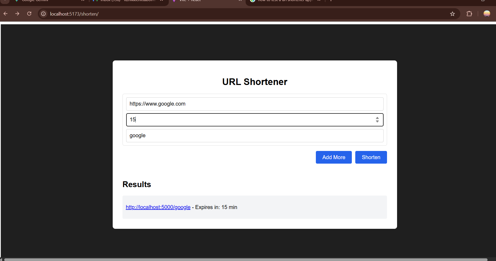
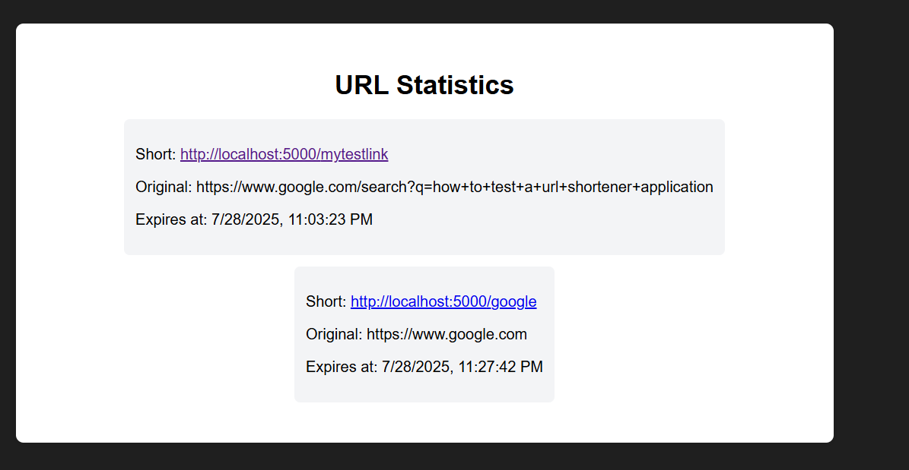

URL Shortener
A simple and efficient URL shortening service built with React for the frontend and designed to interact with a Node.js/Express backend. This application allows users to shorten long URLs, optionally set custom shortcodes, define validity periods, and view statistics for all shortened URLs.

✨ Features
Shorten URLs: Convert long, cumbersome URLs into concise, shareable short links.

Custom Shortcodes: Option to specify a personalized shortcode for easier recall (e.g., yourdomain.com/my-project).

Validity Period: Set an expiration time for shortened URLs (defaulting to 30 minutes if not specified).

URL Statistics: View a list of all shortened URLs, their original counterparts, and their expiry times, including click data.

Instant Redirection: Shortened URLs redirect users to the original destination.

Multiple URL Shortening: Ability to shorten up to 5 URLs at once.

Basic Logging: Backend includes a custom logging middleware for request and event tracking.

🚀 Technologies Used
Frontend:

React: A JavaScript library for building user interfaces.

React Router DOM: For declarative routing in React applications.

Axios: A promise-based HTTP client for making API requests.

CSS-in-JS (Inline Styles): For styling components.

Backend:

Node.js: JavaScript runtime.

Express.js: Web application framework for Node.js.

nanoid: A tiny, secure, URL-friendly, unique string ID generator.

cors: Node.js package for providing a Connect/Express middleware that can be used to enable CORS with various options.

dotenv: Loads environment variables from a .env file.

In-memory Map: Used for simple, temporary storage of URL mappings.

📦 Getting Started
These instructions will get you a copy of the project up and running on your local machine for development and testing purposes.

Prerequisites
Before you begin, ensure you have the following installed:

Node.js (LTS version recommended)

npm (comes with Node.js) or [Yarn)

Git

Installation
Clone the repository:

git clone https://github.com/your-username/URL-SHORTENER.git
cd URL-SHORTENER

Set up the Backend:

Navigate to the server directory (assuming your backend code is in a server folder).

Create a package.json file in the server directory with the following content:

{
  "name": "url-shortener-backend",
  "version": "1.0.0",
  "description": "Backend for the URL Shortener application.",
  "main": "index.js",
  "scripts": {
    "start": "node index.js",
    "dev": "nodemon index.js"
  },
  "keywords": [],
  "author": "[Your Name]",
  "license": "MIT",
  "dependencies": {
    "cors": "^2.8.5",
    "dotenv": "^16.0.0",
    "express": "^4.17.1",
    "nanoid": "^3.0.0"
  },
  "devDependencies": {
    "nodemon": "^2.0.0"
  }
}

Install backend dependencies:

cd server
npm install # or yarn install

Create a logger.js file in the server directory (next to index.js) with the following content:

// logger.js
const log = (service, level, type, message) => {
    const timestamp = new Date().toISOString();
    console.log(`[${timestamp}] [${service.toUpperCase()}] [${level.toUpperCase()}] [${type.toUpperCase()}]: ${message}`);
    // In a real application, you would send this to a logging service (e.g., Splunk, ELK, Cloud Logging)
    // For now, it just prints to the console.
};

module.exports = log;

Create a .env file in the server directory (if you plan to add environment variables later, though not strictly needed for the current in-memory store).

Navigate to the client directory and install dependencies:

cd ../client # Assuming your React app is in a 'client' folder
npm install # or yarn install

🏃‍♀️ Usage
Start the Backend Server:
Navigate to your backend directory (server) and start the server.

cd server
npm start # or npm run dev if you installed nodemon for auto-restarts

Ensure your backend is running on http://localhost:5000.

Start the Frontend Application:
Navigate back to the client directory (where this React app resides) and start the development server.

cd client
npm start # or yarn start

The application will typically open in your browser at http://localhost:5173.

🌐 API Endpoints (as used by the frontend)
This frontend interacts with the following backend API endpoints:

POST /api/shorten

Description: Creates a new shortened URL.

Request Body (JSON):

{
    "originalUrl": "https://www.example.com/very/long/url",
    "validity": 60,       // Optional: Expiry in minutes (e.g., 60 for 1 hour). Defaults to 30.
    "shortcode": "mycustomcode" // Optional: Desired custom shortcode.
}

Response (JSON):

{
    "shortId": "generatedShortCode"
}

or an error object if there's an issue (e.g., shortcode already exists, invalid URL).

GET /api/urls

Description: Retrieves a list of all shortened URLs and their details.

Response (JSON Array):

[
    {
        "shortCode": "abcde",
        "originalUrl": "https://www.google.com",
        "expiry": "2025-07-28T23:00:00.000Z", // ISO 8601 format
        "clicks": [ // Array of click objects
            {
                "timestamp": 1678886400000, // Unix timestamp
                "source": "https://www.google.com", // Referer header
                "location": "192.168.1.1" // IP address
            }
        ]
    },
    // ... more URL objects
]

GET /:shortCode

Description: Redirects the user to the originalUrl associated with the given shortCode.

Behavior: This is a direct HTTP redirect handled by the backend. If the shortcode is not found or expired, it returns a 404 Not Found response.

📸 Screenshots / Demo

1. User Interface (Initial View)
This shows the main page where users can input URLs to shorten :

2. Shortening a URL (Input & Result)
Demonstrates the process of inputting a URL and the resulting shortened link.

(If you have another screenshot like shortening_test2 that shows a different input or result, you can add it here too: )

3. Redirection in Action 
When a user navigates to a shortened URL (e.g., http://localhost:5000/yourshortcode), the application instantly redirects them to the original long URL. This happens seamlessly in the browser.

4. URL Statistics Page
Displays the list of all shortened URLs, their original links, expiry times, and click data :  )

Live Demo: [Your Demo Link Here (e.g., https://your-app-name.vercel.app/shorten)]

🤝 Contributing
Contributions are welcome! If you have suggestions for improvements or find a bug, please open an issue or submit a pull request.

Fork the repository.

Create your feature branch (git checkout -b feature/AmazingFeature).

Commit your changes (git commit -m 'feat: Add some AmazingFeature').

Push to the branch (git push origin feature/AmazingFeature).

Open a Pull Request.

📄 License
This project is licensed under the MIT License - see the LICENSE file for details.

✍️ Author

NikhilChittaboina - https://github.com/nikhil-chittaboina/URL-SHORTENER/
